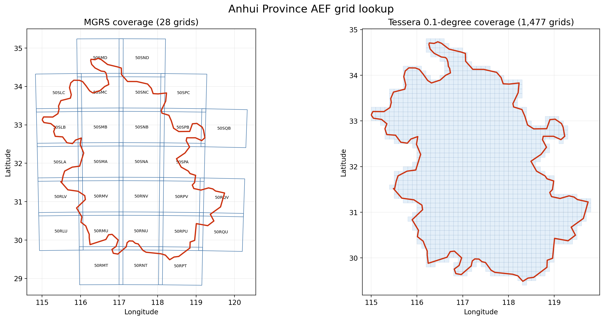

# Anhui AOI grid-lookup validation

This reproducible case validates vector-AOI lookup, bilingual catalog search and
quick visualization. It does not authorize or perform a province-wide AEF download.

## Input and rule

- AOI: one valid Anhui ADM1 polygon in WGS84.
- Bounds: 115.000379–119.739997°E, 29.487235–34.732202°N.
- Names/codes: `安徽省`, `Anhui Province`, `CN-AH`.
- MGRS geometry: the authoritative S1-GRiTS `mgrs.parquet` table.
- Selection: positive-area polygon intersection; boundary-only contact is excluded.
- Administrative names are search aliases copied from AOI fields. Geometry, not a
  province name or an inferred MGRS code, determines membership.

The source ADM1 geometry was obtained from the
[geoBoundaries China ADM1 feature layer](https://services1.arcgis.com/x5wCko8UnSi4h0CB/ArcGIS/rest/services/China_Steel/FeatureServer/0).



## Commands

```powershell
python scripts/resolve_aef_grid_ids.py `
  --aoi outputs/grid_lookup/anhui_test/source/anhui_bilingual.gpkg `
  --layer province `
  --region-id-field province_code `
  --name-field-cn province_cn --name-field-en province_en `
  --mgrs-index D:/Project/claude-demo/S1-GRiTS/src/s1grits/data/mgrs.parquet `
  --out-dir outputs/grid_lookup/anhui_test/resolved_bilingual

python scripts/visualize_aef_grid_lookup.py `
  --intersections outputs/grid_lookup/anhui_test/resolved_bilingual/grid_intersections.parquet `
  --aoi outputs/grid_lookup/anhui_test/source/anhui_bilingual.gpkg `
  --layer province `
  --out outputs/grid_lookup/anhui_test/anhui_grid_coverage_quicklook.png `
  --title "Anhui Province AEF grid lookup"
```

Search validation:

```powershell
python scripts/search_aef_grid_catalog.py `
  --catalog outputs/grid_lookup/anhui_test/resolved_bilingual/grid_catalog.parquet `
  --query "安徽省" --scheme mgrs --ids-only
```

Replacing the query with `Anhui Province` or `CN-AH` returns the same list.

## Result

| Check | Result |
|---|---:|
| Regions | 1 |
| MGRS grid IDs | 28 |
| Tessera 0.1-degree grid IDs | 1,477 |
| Catalog rows | 1,505 |
| Duplicate `(scheme, grid_id)` rows | 0 |
| MGRS projected CRS | EPSG:32650 (UTM zone 50N) |
| Chinese/English/code search agreement | Exact |

MGRS list:

```text
50RLU 50RLV 50RMT 50RMU 50RMV 50RNT 50RNU
50RNV 50RPT 50RPU 50RPV 50RQU 50RQV
50SLA 50SLB 50SLC 50SMA 50SMB 50SMC 50SMD
50SNA 50SNB 50SNC 50SND 50SPA 50SPB 50SPC 50SQB
```

Local generated products:

```text
outputs/grid_lookup/anhui_test/
├── anhui_grid_coverage_quicklook.png
├── anhui_grid_coverage_quicklook.svg
├── anhui_grid_coverage_quicklook.report.json
└── resolved_bilingual/
    ├── grid_catalog.parquet
    ├── grid_intersections.parquet
    ├── grid_ids.json
    ├── mgrs_grid_ids.txt
    └── tessera_0p1_grid_ids.txt
```

The 1,477-cell count is a warning against treating a province name as permission
to download every 10 m embedding grid. Start with one explicit grid and one year,
measure the result, and only then approve a larger named grid list.
